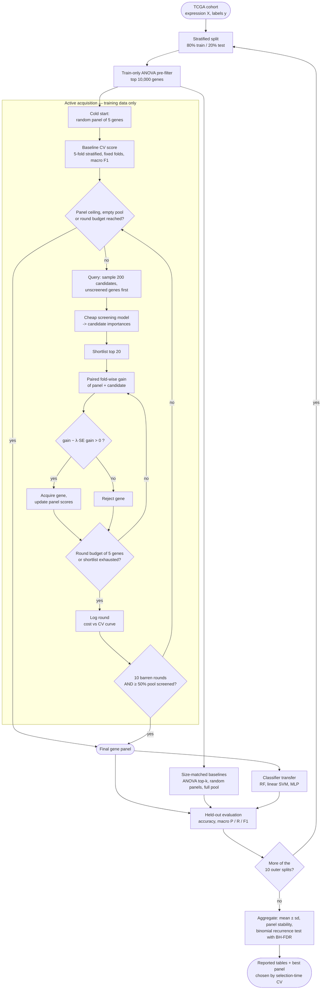

# Active Feature Acquisition Pipeline (`tcga_active_fs_4.py`)

Notation follows the usual feature-selection convention (Guyon & Elisseeff 2003;
Chandrashekar & Sahin 2014): rounded nodes are inputs/outputs, rectangles are
processing steps, diamonds are decisions, and the feedback arcs are the wrapper loop.

**Key design points**

- All selection happens on training data only; the test split is touched once, for reporting.
- Folds are fixed by a single seed for the whole run, so candidate comparisons are *paired*.
- The acceptance gate `gain − λ·SE(gain) > 0` rejects genes whose benefit is inside CV noise.
- Patience cannot trigger before half the pool has been screened, so a cold start cannot stop the search early.
- The per-round history *is* the cost-vs-accuracy curve; no separate panel-size sweep or second argmax is taken.
- The best panel is picked by selection-time CV score, keeping the reported test metric unbiased.
